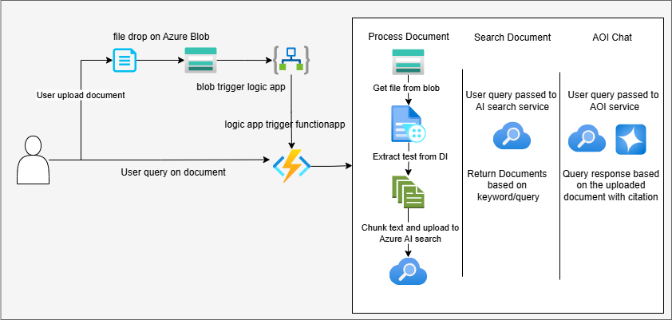

# 🧠 Document Processing and AI Search Service

This project is a cloud-native document search and AI chat solution built using **Azure services**. It allows you to upload documents (PDF, TXT, CSV, etc.) to Azure Blob Storage, extract content using Document Intelligence, index them into Azure Cognitive Search, and then **search** or **chat** with the content using **Azure OpenAI**.

---

## 🌐 Live Demo (Azure Function App)

| Endpoint            | Description                                                  |
|---------------------|--------------------------------------------------------------|
| `/api/process-doc`  | Upload and process document from blob storage                |
| `/api/search`       | Perform keyword search on indexed documents                  |
| `/api/aoi-chat`     | Ask questions using Azure OpenAI on indexed document content |


---

## 📦 Technologies Used

- Azure Blob Storage
- Azure AI Document Intelligence (Form Recognizer)
- Azure Cognitive Search
- Azure OpenAI (Chat Completions)
- Azure Function App (Python HTTP Trigger)

---
## 🖼️ Solution Diagram


---

## ✅ Features

- 📂 Upload & extract content from .pdf, .txt, .csv
- 🔍 Search indexed documents via Azure AI Search
- 💬 Chat with documents using Azure OpenAI
- 🚀 Deployed on Azure as an HTTP-triggered Function App
---
## 🛠️ Local Development
### 🔧 Pre-requisites
- Python 3.9 / 3.10
- [Azure CLI](https://learn.microsoft.com/en-us/cli/azure/install-azure-cli)
- [Azure Functions Core Tools](https://learn.microsoft.com/en-us/azure/azure-functions/functions-run-local)
### 📥 Setup

1. Clone the repo:
   ```bash
   git clone https://github.com/hassan-imagyn/DocumentProcessingRAG.git
   cd DocumentProcessingRAG
2. Create virtual environment:
   ```bash
    python -m venv venv
    source venv/bin/activate  # or venv\Scripts\activate (Windows)
4. Install dependencies:
   ```bash
    pip install -r requirements.txt
6. Set environment variables in local.settings.json:
   ```json
    {
    "IsEncrypted": false,
    "Values": {
    "AzureWebJobsStorage": "<Your Azure Storage connection string>",
    "FUNCTIONS_WORKER_RUNTIME": "python",

    "AI_SEARCH_ENDPOINT": "<Your Azure Cognitive Search endpoint>",
    "AI_SEARCH_ADMIN_KEY": "<Your Azure Cognitive Search admin key>",
    "AI_SEARCH_INDEX_NAME": "<Your index name>",

    "BLOB_CONNECTION_STRING": "<Your Azure Blob connection string>",
    "BLOB_CONTAINER_NAME": "<Your blob container name>",
    "Blob_baseUrl": "<Base URL to access blobs from the web>",

    "AZURE_DOC_INTEL_ENDPOINT": "<Document Intelligence endpoint>",
    "AZURE_DOC_INTEL_KEY": "<Document Intelligence key>",

    "AZURE_OPENAI_ENDPOINT": "<Azure OpenAI endpoint>",
    "AZURE_OPENAI_KEY": "<Azure OpenAI key>",
    "AZURE_OPENAI_DEPLOYMENT": "<Your deployment name>"
     }
     }


▶️ Run Locally
1. Start the Azure Function locally:
   ```bash
    func start
2. Call endpoints like:
   ```bash
    curl http://localhost:7071/api/search?q="data"

☁️ Deployment to Azure
1. Login:
   ```bash
   az login
   az account set --subscription "<your-subscription-name>"

3. Deploy:
   ```bash
   func azure functionapp publish <function-app-name>
   
3. Set all variables from local.settings.json in Azure → Function App → Configuration.

💡 Sample Usage
```bash
# Trigger document processing
curl https://<your-app>/api/process-doc?filename=invoice.pdf

# Perform keyword search
curl https://<your-app>/api/search?q="invoice"

# Ask natural questions
curl https://<your-app>/api/aoi-chat?q="What is the total amount?"
